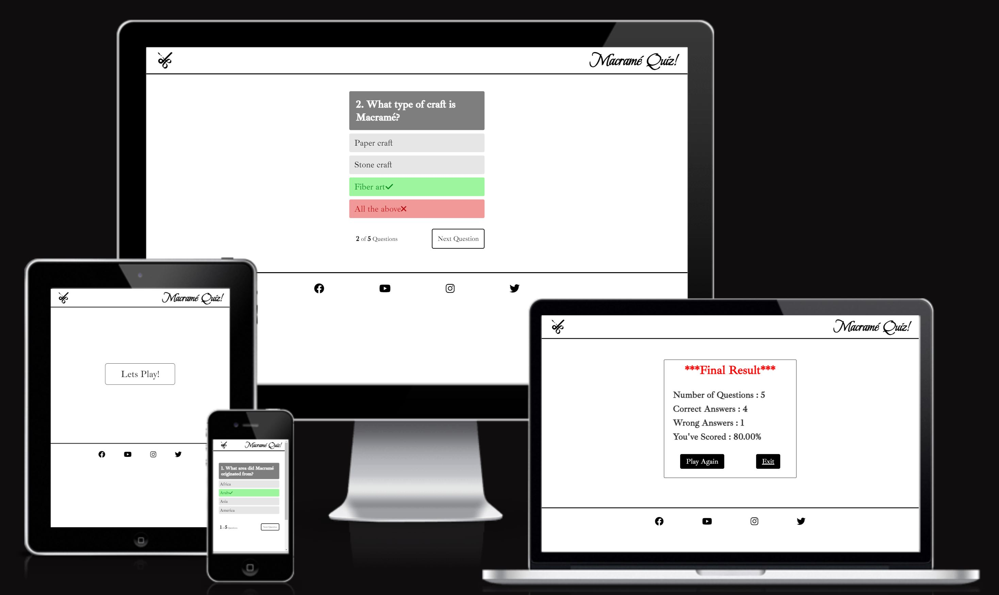
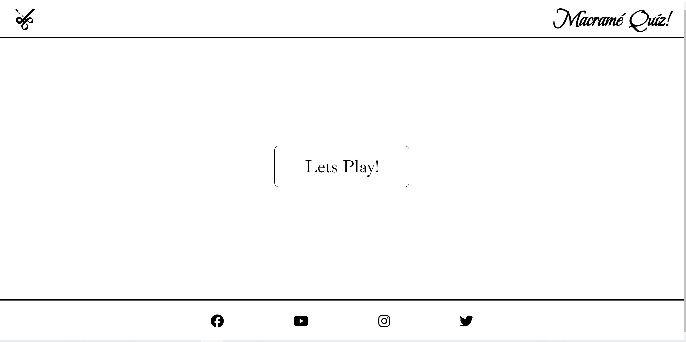
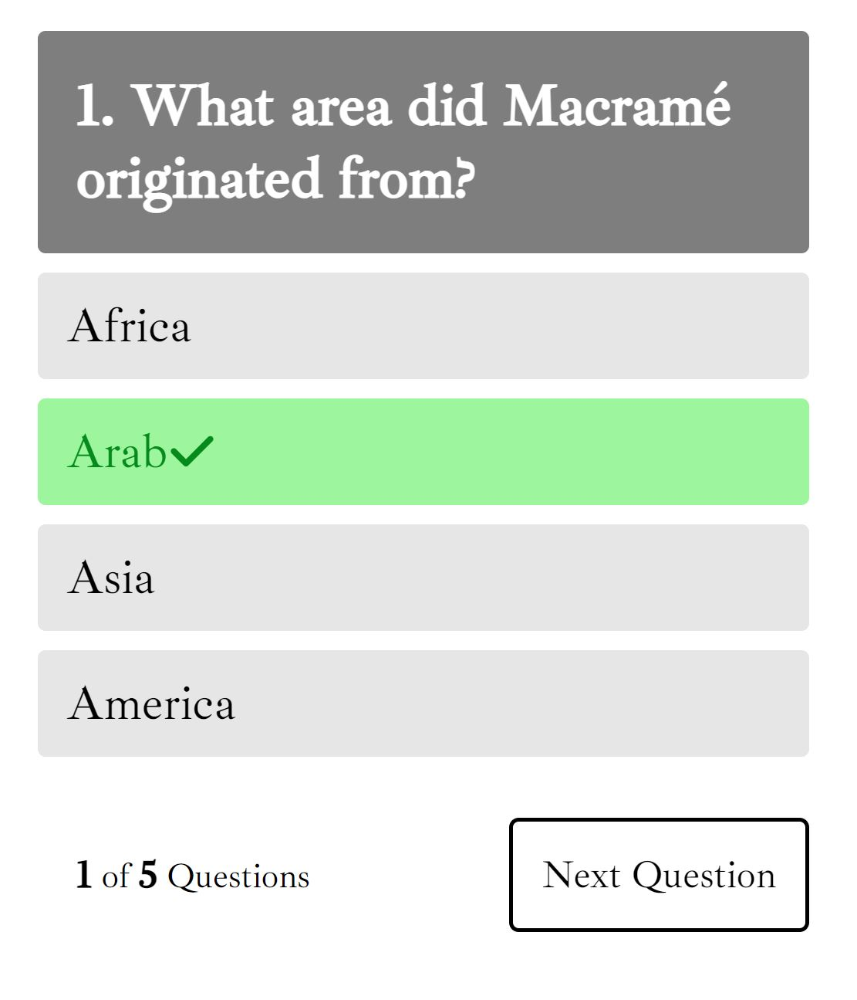
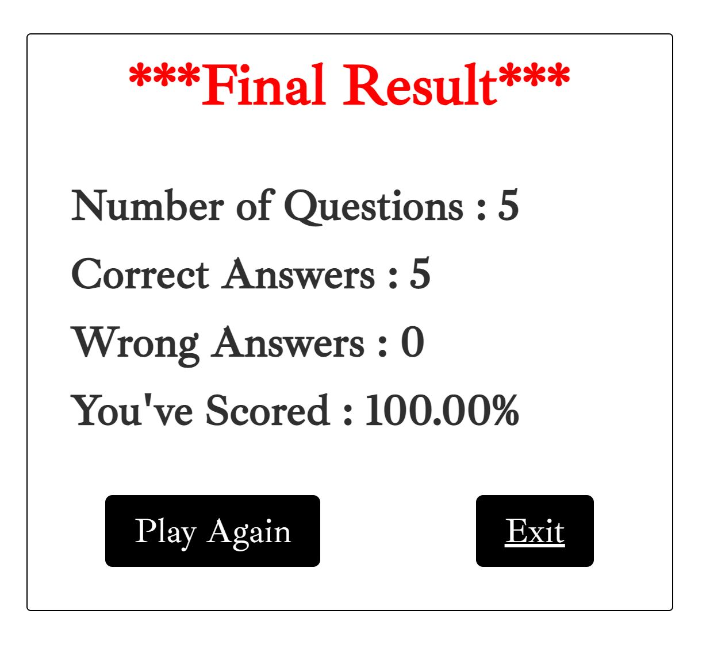
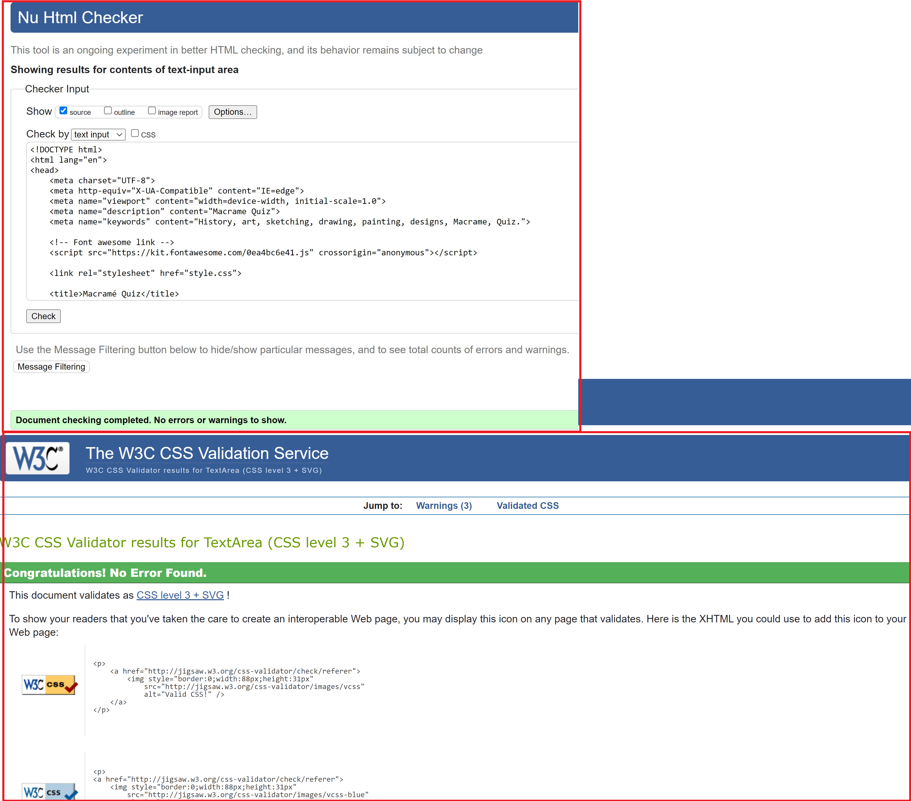
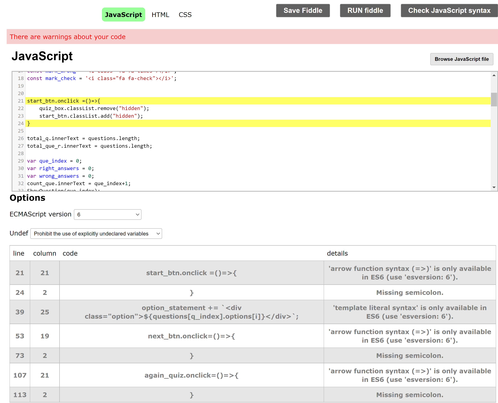
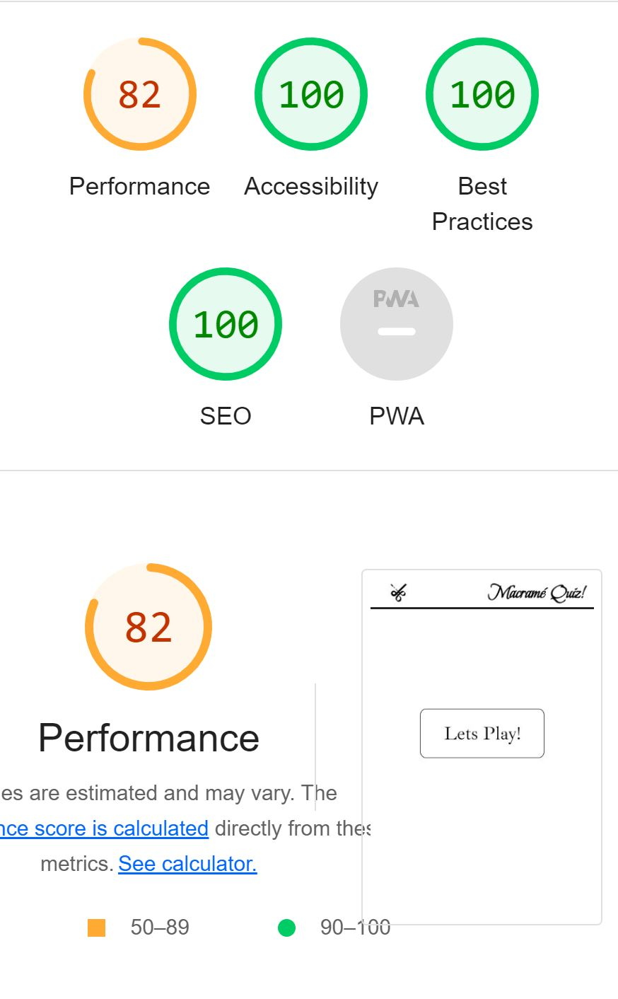

# Macramé Quiz

# Goal for this Project
Welcome to Macramé Quiz.
Reason for choosing a quiz for my project is to test the knowledge of the person and see if they know the basics of Macramé, I have added few history questions and few questions from the present time. 
This project also directly connects with my first project "The Knots".

Goal for this project is to show what I have learnt so far and have some fun at the sametime.

# Table of Contents
* [UX](#ux "UX")
    * [User Goals](#user-goals)
    * [User Inputs](#user-inputs)
    * [Owner Goals](#owner-goals)
    * [Requirements](#requirements)
    * [Expectations](#expectations)
    * [Design Choices](#design-choices)
        * [Fonts](#fonts)
        * [Icons](#icons)
    * [Wireframes](#wireframes)
    * [Features](#features)
        * [Existing Features](#existing-features)
            * [Welcome Page](#welcome-page)
            * [Quiz Page](#Quiz-page)
            * [Scoreboard Result](#Scoreboard)
        * [Unfixed Bugs](#unfixed-bugs)
    * [Languages and Websites used](#languages-and-websites-used)
        * [Languages that I used](#languages-that-i-used)
        * [Tools](#tools)
    * [Testing](#testing)
        * [Responsiveness](#responsiveness)
        * [Validation](#validation)
        * [Lighthouse](#lighthouse)
    
    * [Credits](#credits)

# UX

## User Goals
* Visually appealing.
* Easily navigated around.
* Quality and valuable content.

## User Inputs
* As a user I want to see my score in the end.
* As a user I want to be asked tricky question so I can test my knowlodge about Macramé.
* As a user I want to be able to make contact to the website owner via different social media.
* As a user I want to be able to easily navigate through the website.

## Owner Goals
* Spread as much information as possible about Macramé.
* Increase the number of visiters.
* Increase rankings on search engines.

### Requirements
* Easy to navigate on various screen sizes.
* Keep the user interested with information to make them want to engage with the website.
* Visually inviting so users do not leave and would recommend to friends and family.

### Expectations
* I expect all links to social media sites to be opened in a new tab.
* I expect all navigation links to work correctly.
* I expect screen size would not affect the quality of the website.
* I expect all answers to the questions to be correct and accurate.

## Design Choices

### Fonts
In order to make the quiz more appealing, I have used the 
[Google Fonts](https://fonts.google.com/ "Google Fonts") to find a text that best suits the feel of the website. For the main "Macramé Quiz" I have used [Beau Rivage](https://fonts.google.com/specimen/Beau+Rivage?query=mon "Beau Rivage Font") as I believe it gives the "Macramé" sort of feel and also it needed to look different than the rest of the website but not too different that it starts looking weird. For the questions I have used the [Ibarra Real Nova]('https://fonts.googleapis.com/css2?family=Ibarra+Real+Nova:wght@400;500&display=swap') font and for the options I used the [Lato]('https://fonts.googleapis.com/css2?family=Lato:wght@300&display=swap') font.
I believe these two font sits really well together.

### Icons
I have used icons for my website from the [Font Awesome library](https://fontawesome.com/ "Font Awesome"). These icons will only be used where there is no explination is needed and are really common among the users like social media links.

\
&nbsp;
[Back to Top](#table-of-contents)
\
&nbsp;

# Wireframes
I have used Photoshop to develop wireframes for my website. I initially created the desktop version first and then scalled it down for tablet and smart phones. Because a requirement is to give little but quality information to the user to make them want to engage with the quiz.

**Wireframe Home Page**

**Wireframe Scoreboard**

\
&nbsp;
[Back to Top](#table-of-contents)
\
&nbsp;

# Features

## Existing Features

   ### Welcome Page

   *Desktop*

+ The welcome page includes "Lets Play" button. Once this button is pressed the quiz will start.

    

### Quiz page

+ The Quiz page includes questions and answer choices.
It also includes useful information such as number of questions.

    

 ### Scoreboard

+ This page includes the total score that user has scored.
There are also couple of usefull buttons to navigate such as "Play Again" and "Exit" button. Clicking on the "Exit" button will take the user to the home page.

    

    \
&nbsp;
[Back to Top](#table-of-contents)
\
&nbsp;

## Unfixed Bugs

There are no unfixed bugs.

# Languages and Websites used

## Languages that I used
* [HTML](https://en.wikipedia.org/wiki/HTML "HTML")
* [CSS](https://en.wikipedia.org/wiki/CSS "CSS")
* [Javascript](https://en.wikipedia.org/wiki/JavaScript "Javascript")

## Tools
* [Gitpod](https://www.gitpod.io/ "Gitpod")
* [Photoshop](https://en.wikipedia.org/wiki/Adobe_Photoshop "Photoshop")
* [W3C HTML Validation Service](https://validator.w3.org/ "W3C HTML")
* [W3C CSS Validation Service](https://jigsaw.w3.org/css-validator/ "W3C CSS")
* [Extends Class Validation Service](https://extendsclass.com/javascript-fiddle.html "extendsclass")
* [Font Awesome library](https://fontawesome.com/ "Font Awesome")
* [Google Fonts](https://fonts.google.com/ "Google Fonts")

# Testing

## Responsiveness

I feel that the site has hit the goals that are required by everyone. The site responds nicely to all different screen sizes, the question section looks clean and responsive. The content is simple and to the point and the site is not overcrowded.
\
&nbsp;

## Validation

I have validated my project with the [W3C Validator](https://www.w3.org/ "HTML and CSS") and I used [ExtendsClass](https://extendsclass.com/javascript-fiddle.html"JavaScript") to validate my Javascript codes.

I've got few warnings for my JavaScript files but most of them were for "Missing semicolon" so I left them the way they were.

Below are the validation images.

## Lighthouse

\
&nbsp;
[Back to Top](#table-of-contents)
\
&nbsp;

# Formation

Following writing the code then commiting and pushing to GitHub, this project was formed using GitHub by the following steps.

+ Navigate to the repository on github and click 'Settings'.
+ Then select 'Pages' on the side navigation.
+ Select the 'None' dropdown, and then click 'master'.
+ Click on the 'Save' button.
+ Now the website is live on [https://naqij.github.io/Macrame-Quiz/]
+ If any changes are required or made they can be done by committing and push to GitHub and the changes will be updated.

# Credits

I would like to thanks.
* [Simen Daehlin](https://github.com/Eventyret "Simen Daehlin")

And **Kenan Wright**

For code insperation, help, advice and encouragment.

&nbsp;

For content and style insperation,

I used my wife's (Daima Zainab) thesis on Macramé and Celtic art.
* [Instagram page of Daima Zainab](http://instagram.com/daimaaaz_?igshid=YmMyMTA2M2Y= "Instagram page of Daima Zainab")

&nbsp;

For code insperation I have looked into my first project "The Knots" to see which way the code reacted if changed into certain way and then applied the same method on my second project which is Macramé Quiz project.
I also wanted to keep the same theme as my first project so in future I could link the quiz to my website.

For code inspirations I went through my notes that I took throughout the course and also I checked out few Youtube videos such as (https://www.youtube.com/watch?v=WUBhpSRS_fk&ab_channel=CodingNepal) to understand the codes better and use them correctly.

I have also used [https://www.w3schools.com/] for code insperation and testing the code before using on my website.

\
&nbsp;
[Back to Top](#table-of-contents)
\
&nbsp;